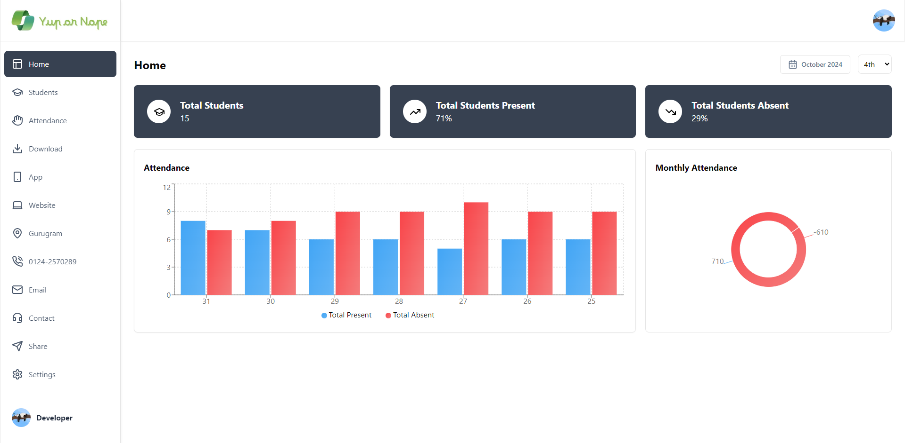

<a name="readme-top"></a>

# Yup or Nope - An Attendance Platform

This project stands for tracking and marking attendance, a widely required tool for institutions. It enables teachers to securely log in, adding students and their information, marking attendance by checking boxes and access various functionalities such as report sharing and downloading.



## <a name="table">Table of Contents</a>

1. [Tech Stack](#tech-stack)
2. [Features](#features)
3. [Getting Started](#getting-started)
4. [Contributors](#contributors)
5. [Feedback](#feedback)


## <a name="tech-stack">Tech Stack</a>

- Next.js
- JavaScript
- Kinde
- Neon - Postgresql
- Drizzle
- Neon
- React
- shadcn
- Tailwind CSS

## <a name="features">Features</a>

- **Authentication**: Implements authentication and authorization features using Kinde, allowing users to securely log in via social sign-on or traditional email and password methods, while ensuring appropriate access levels and permissions within the platform.

- **Appealing Interface** On home page bar graphs and pie charts are there, select month and grade and booooom.

- **Report Sharing** Share attendance report with others easily via any social media or apps.

- **Collaboration** Any class teacher can simultaneously access whole school students list and can mark attendance.

- **Adding Students** Onboard students with the correct and relevant information.

- **Delete Students** Easily delete students from the students list in case he/she no more in your institution.

- **Report Download** Use Download section to get all the data saved in your device.

- **Search Functionality** Powerful search tools to quickly locate students using roll number, grade & section, or address.

- **Mark Attendance** Go to attendance section choose the class and start marking attendance also can see previous months attendance.

- **Security Features** Protect account with encryption and two-factor authentication for added security.

- **Responsive Design** Follows responsive design principles to ensure optimal user experience across devices, adapting seamlessly to different screen sizes and resolutions.

## <a name="getting-started">Getting Started</a>

Prerequisites

- [Git](https://git-scm.com/)
- [Node.js](https://nodejs.org/en)
- [npm](https://www.npmjs.com/) (Node Package Manager)

Now Follow these steps for cloning:

1. **Cloning:** Run the following command in your terminal or command prompt to clone the repository to your local machine:

```bash
git clone https://github.com/theankushshah/Yup-or-Nope.git
```

2. **Navigate to the Directory:** Once cloned, navigate into the project directory using the `cd` command:

```bash
cd yup-or-nope-clone
```

If you don't want to clone, instead want to create seperate, do these steps:


1. **Download ZIP Code folder:** Unzip the folder in your machine


2. **Navigate to the Downloaded Directory:** Open your code editor and open the unzipped folder in it then:

```bash
cd /path/to/downloaded/folder
```

Now Follow these steps for both cloning & download:

1. **Dependencies Installation:**

```bash
npm install
```

2. **Environment Variables & Database Setup:** Create a new file named `.env` in the root of your project and add the following content:

```env
KINDE_CLIENT_ID=
KINDE_CLIENT_SECRET=

KINDE_ISSUER_URL=
KINDE_SITE_URL=

KINDE_POST_LOGOUT_REDIRECT_URL=
KINDE_POST_LOGIN_REDIRECT_URL=

DRIZZLE_DATABASE_URL=
```

(Don't get confuse by (DRIZZLE_DATABASE_URL) It's actually Neon Postgresql Database but we just named it like DRIZZLE_DATABASE_URL)
Replace the placeholder values with your actual Kinde & Database credentials. You can obtain these credentials by signing up on the [Kinde website](https://kinde.com/) and [Neon website](https://www.neon.tech/)

3. **Database Run:**

Run the following command to run the database:

```bash
npm run db:push
npm run db:studio 
```

Open [https://local.drizzle.studio](https://local.drizzle.studio) in your browser to view the database.

4. **Running:**

```bash
npm run dev
```

Open [http://localhost:3000](http://localhost:3000) in your browser to view the project.

5. **Start modifying:** Feel free to edit the code according to your requirements. 

6. **Testing**

```bash
npm test
```

7. **Build for Production**

```bash
npm run build
```

Now Follow these steps for both download & cloning in order to upload on github:

1. **Initialize a New Git Repository:**

```bash
git init
```

2. **Stage and Commit the Code:**

```bash
git add .
git commit -m "Initial commit with downloaded code"
```

3. **Create a New Repository on GitHub:**

Note - Do NOT initialize the new repository with a README, .gitignore, or license (since the code is already downloaded & cloned, it’s not needed).

4. **Link Local Repository to GitHub:**

```bash
git remote add origin https://github.com/username/new-repo.git
```

Replace https://github.com/username/new-repo.git with your actual repository URL.

5. **Push Code to GitHub:**

```bash
git branch -m main
git pull origin main
git push -u origin main
```

6. **Deployment:** Deploy the application to your preferred hosting platform to make it accessible online.


Now Follow these steps if you're forking:

1. **Forking:** Run the following command in your terminal or command prompt to fork the repository to your local machine:

```bash
git clone https://github.com/your-username/Yup-or-Nope.git
```

2. **Navigate to the Directory:** Once cloned, navigate into the project directory using the `cd` command:

```bash
cd yup-or-nope
```

5. **Start Coding:** Make the additions & desired changes to the code.


3. **Commit & Push Your Changes to Your Fork:** Once cloned, navigate into the project directory using the `cd` command:

```bash
git add .
git commit -m ""
git pull origin main
git push -u origin main
```

3. **Create a Pull Request:**

- Go to your forked repository on GitHub
- Click the "Compare & pull request" button.
- Review your changes and write a clear description of your contribution.
- Click "Create pull request"

I will review your pull request and decide whether to merge your changes into my repository or not.

## Feedback

You might encounter some bugs while using this app. You are more than welcome to contribute. Just submit changes via pull request and I will review them before merging. Make sure you follow community guidelines.

## Developer & Main

- Ankush Shah (ankushsahvlogs@gmail.com) (Main)

Happy coding! 🚀