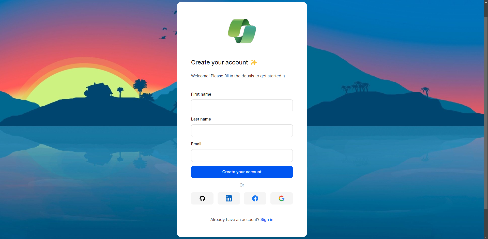
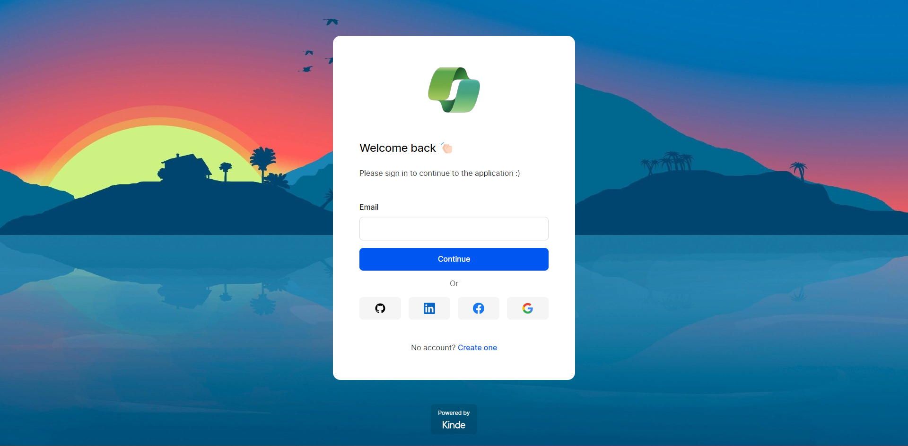
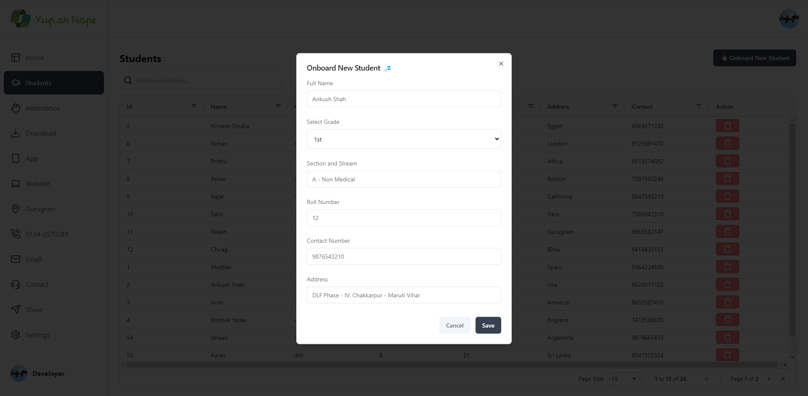
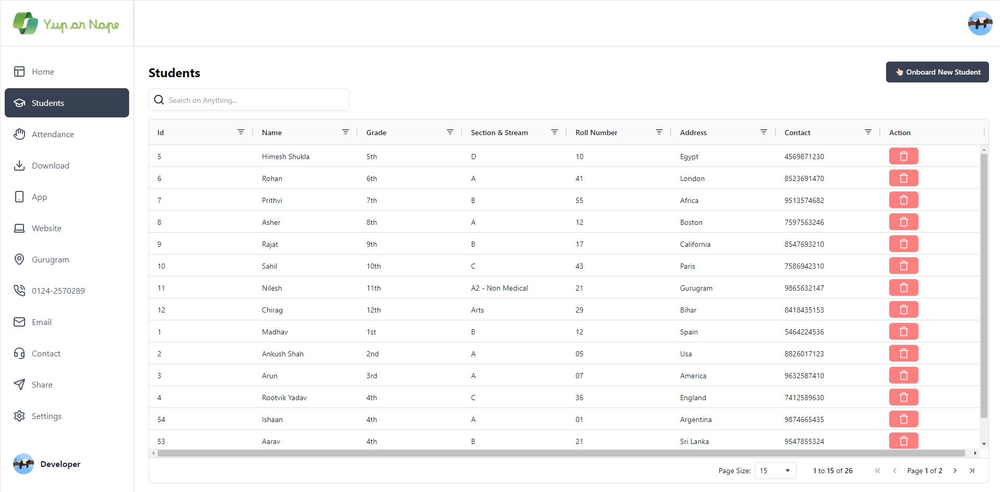
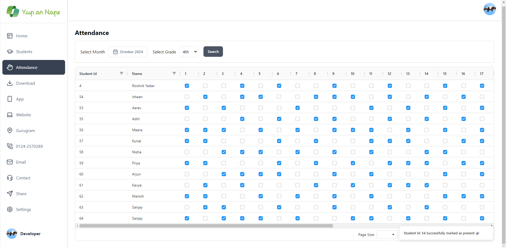

<a name="readme-top"></a>

# Yup or Nope - A Students Attendance Tracking Platform


## <a name="table">Table of Contents</a>

1. [Introduction](#introduction)
2. [Tech Stack](#tech-stack)
3. [Features](#features)
4. [Getting Started](#getting-started)
5. [Screenshots](#more-screenshots)
6. [Feedback](#feedback)

## <a name="introduction">Introduction</a>

Built with the latest Next.js and JavaScript, this project stands for tracking and marking attendance, a widely required tool for institutions. It enables teachers to securely log in, adding students and their information, marking attendance by checking boxes and access various functionalities such as report sharing and downloading.

## <a name="tech-stack">Tech Stack</a>

- Next.js
- JavaScript
- Kinde
- Neon - Postgresql
- Drizzle
- Neon
- React
- shadcn
- Tailwind CSS

## <a name="features">Features</a>

**Authentication**: Implements authentication and authorization features using Kinde, allowing users to securely log in via social sign-on or traditional email and password methods, while ensuring appropriate access levels and permissions within the platform.

**Appealing Interface**: On home page bar graphs and pie charts are there, select month and grade and booooom.

**Report Sharing**: Share attendance report with others easily via any social media or apps.

**Collaboration**: Any class teacher can simultaneously access whole school students list and can mark attendance.

**Adding Students**: Onboard students with the correct and relevant information.

**Delete Students**: Easily delete students from the students list in case he/she no more in your institution.

**Report Download**: Use Download section to get all the data saved in your device.

**Search Functionality**: Powerful search tools to quickly locate students using roll number, grade & section, or address.

**Mark Attendance**: Go to attendance section choose the class and start marking attendance also can see previous months attendance.

**Security Features**: Protect account with encryption and two-factor authentication for added security.

**Responsive Design**: Follows responsive design principles to ensure optimal user experience across devices, adapting seamlessly to different screen sizes and resolutions.

and many more, including code architecture and reusability. 

## <a name="getting-started">Getting Started</a>

**Make sure you have the following installed on your machine**

- [Git](https://git-scm.com/)
- [Node.js](https://nodejs.org/en)
- [npm](https://www.npmjs.com/) (Node Package Manager)

**Cloning the Repository**

```bash
git clone https://github.com/theankushshah/Yup-or-Nope.git
cd yup-or-nope-clone
```

**Installation**

Install the project dependencies using npm:

```bash
npm install
```

**Set Up Environment Variables**

Create a new file named `.env` in the root of your project and add the following content:

```env
KINDE_CLIENT_ID=
KINDE_CLIENT_SECRET=

KINDE_ISSUER_URL=
KINDE_SITE_URL=

KINDE_POST_LOGOUT_REDIRECT_URL=
KINDE_POST_LOGIN_REDIRECT_URL=

DRIZZLE_DATABASE_URL=
```

Replace the placeholder values with your actual Kinde & Database credentials. You can obtain these credentials by signing up on the [Kinde website](https://kinde.com/) and [Neon website](https://www.neon.tech/)

**Running the Project**

```bash
npm run dev
```

Open [http://localhost:3000](http://localhost:3000) in your browser to view the project.

## More Screenshots











## Feedback

You might encounter some bugs while using this app. You are more than welcome to contribute. Just submit changes via pull request and I will review them before merging. Make sure you follow community guidelines.

## Developer & Main

- Ankush Shah (ankushsahvlogs@gmail.com) (Main)

Happy coding! 🚀